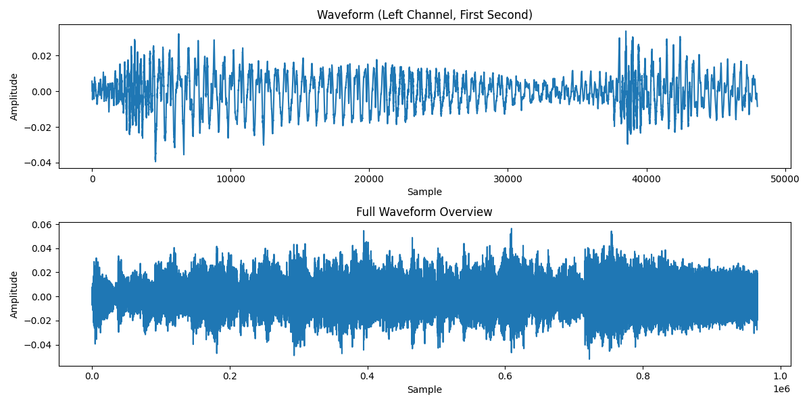
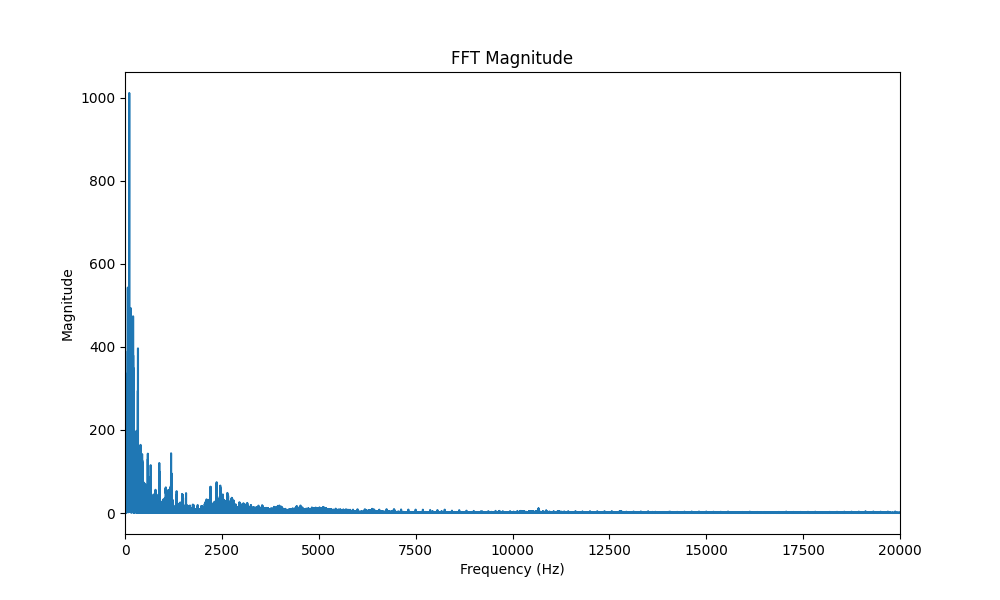
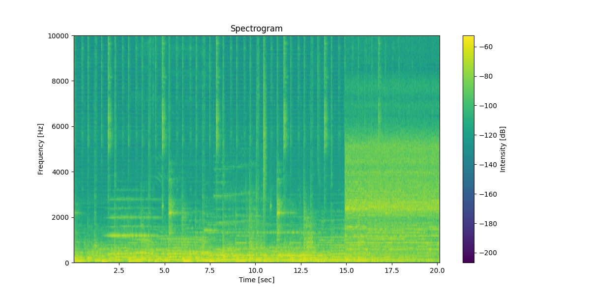
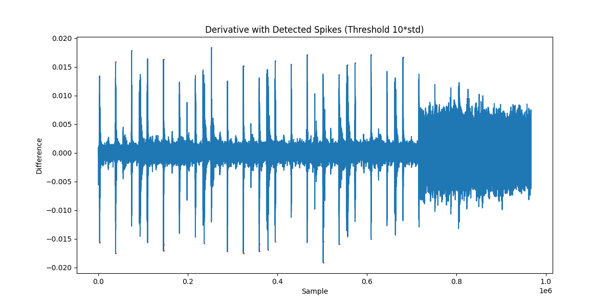

# Audio Analysis Report: rec_00024.wav

## File Information
- Sample Rate: 48000 Hz
- Channels: Stereo
- Duration: 20.14 seconds
- Data Type: float32

## Waveform Analysis

The waveform shows the audio signal over time. The first second is plotted in detail, and the full overview shows the entire recording.

## Frequency Analysis

The FFT shows the frequency content of the signal. Look for any unusual peaks or patterns.

The spectrogram shows how frequency content changes over time. Periodic glitches may appear as vertical lines or patterns.

## Glitch Detection
Number of detected glitch points (threshold 10*std): 30

Spikes in the signal derivative indicate sudden changes, potentially glitches.

## Silence Analysis
Number of silent runs (amplitude < 0.01): 20670
Average silent run length: 31.2 samples (0.7 ms)

Expected SD write interval: 2048 samples (42.7 ms)

## Buffer Analysis
Audio block size: 512 floats
SD write chunk size: 4096 floats
Spikes near audio block boundaries: 0
Spikes near SD write boundaries: 0

## Findings
Periodic glitches detected. Glitch periodicity does not clearly align with buffer boundaries.
